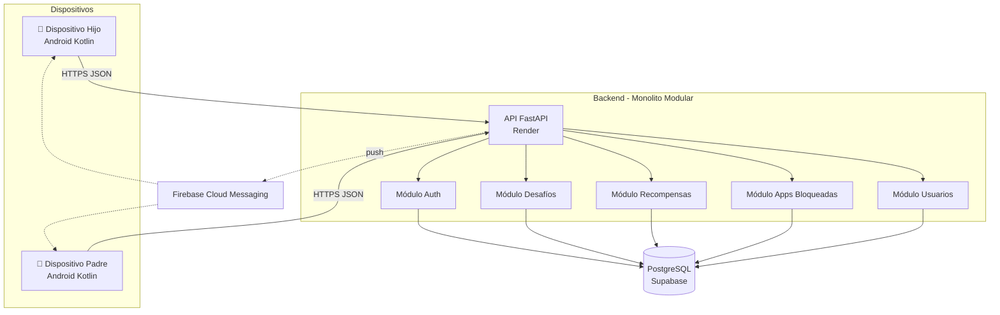
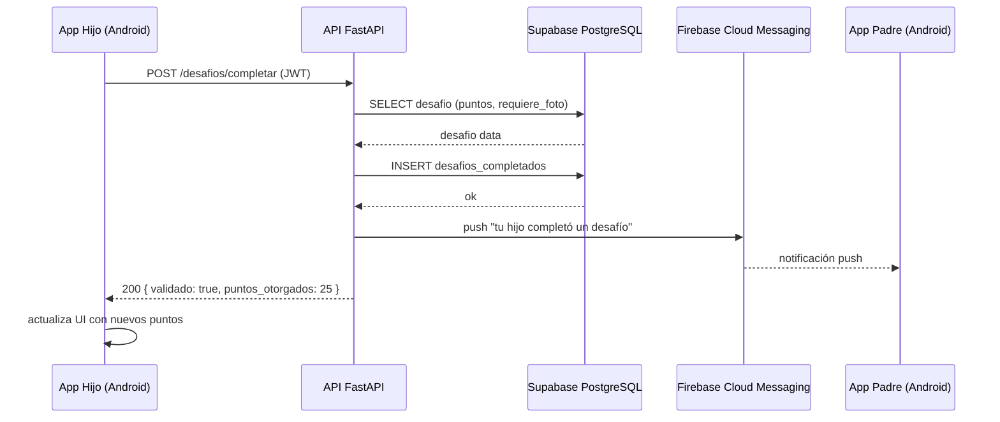

# Arquitectura – MapacheSecure

**Asignatura:** TPY1101 – Taller Aplicado de Programación  
**Integrantes:** Fernanda Arraño · Javier Vieytes · Benjamín Castillo  
**Equipo:** 1 · Sección: 001D

---

## 1. Contexto

- **Problema:** Niños y adolescentes entre 5 y 15 años presentan consumo excesivo e incontrolado de aplicaciones de entretenimiento digital, sin herramientas efectivas que permitan a los padres regularlo de forma motivadora.
- **Usuarios objetivo:** Hijos (5–15 años) como usuario activo de la app, y padres/tutores (28–50 años) como panel de control.
- **Volumen esperado primer año:** 100–500 familias, equivalente a 200–2.000 dispositivos Android activos.
- **Tipo de aplicación:** App móvil nativa Android con backend cloud REST.

---

## 2. Requisitos funcionales clave

- El sistema debe interceptar el intento de apertura de apps bloqueadas y mostrar un desafío antes de permitir el acceso.
- El hijo debe poder completar desafíos cognitivos, físicos y de orden/hogar para desbloquear tiempo de pantalla.
- El sistema debe otorgar MapachePoints automáticamente al completar desafíos y permitir canjearlos por recompensas.
- El padre debe poder configurar qué apps requieren desafío, definir horarios de bloqueo y personalizar recompensas desde un panel protegido.
- El sistema debe enviar notificaciones push al padre cuando el hijo completa un desafío y emitir reportes diarios de uso.
- El progreso, puntos y logs deben sincronizarse en tiempo real con la nube para persistir entre dispositivos.

---

## 3. Requisitos no funcionales

- **Seguridad:** Panel parental protegido por autenticación (Supabase Auth). Tokens JWT para todas las llamadas a la API. Contraseñas nunca almacenadas en texto plano.
- **Rendimiento:** La pantalla de bloqueo debe superponerse en menos de 500 ms tras detectar la app bloqueada. La API debe responder en menos de 1 segundo bajo carga normal.
- **Escalabilidad:** Monolito modular en FastAPI soporta hasta 10.000 dispositivos concurrentes sin cambios de arquitectura.
- **Disponibilidad:** Backend desplegado en Render con CI/CD automático desde GitHub. Uptime objetivo: 99%.
- **Privacidad (Ley 19.628):** Datos de menores de edad tratados con consentimiento explícito del tutor. Sin almacenamiento de contenido de pantalla ni imágenes fuera del contexto de desafíos.

---

## 4. Patrones frontend – Android (Kotlin)

### 4.1. MVVM (Model–View–ViewModel)

Patrón principal de la app Android. Separa la lógica de presentación de la UI, lo que facilita el testing y evita que las Activities/Fragments acumulen lógica de negocio.

```
ui/
├── hijo/
│   ├── HomeHijoFragment.kt       ← View
│   ├── HomeHijoViewModel.kt      ← ViewModel
│   └── DesafioFragment.kt
├── padre/
│   ├── PanelPadreFragment.kt
│   └── PanelPadreViewModel.kt
└── auth/
    ├── LoginFragment.kt
    └── LoginViewModel.kt
```

### 4.2. Repository Pattern (frontend)

Los ViewModels no llaman directamente a la API. Pasan por un repositorio que decide si usar caché local (Room) o la red (Retrofit).

```kotlin
class PuntosRepository(
    private val api: MapacheApi,
    private val dao: PuntosDao
) {
    suspend fun getPuntos(hijoId: String): Int {
        return try {
            val remoto = api.getPuntos(hijoId).totalPuntos
            dao.guardar(hijoId, remoto)
            remoto
        } catch (e: Exception) {
            dao.getPuntos(hijoId) ?: 0   // fallback offline
        }
    }
}
```

### 4.3. Service en segundo plano (Bloqueo)

El servicio de intercepción usa `UsageStatsManager` de Android para detectar la app en primer plano y superponerse con la pantalla de desafío.

```kotlin
class BloqueoService : AccessibilityService() {
    override fun onAccessibilityEvent(event: AccessibilityEvent) {
        val packageActual = event.packageName?.toString() ?: return
        if (appsBlockeadas.contains(packageActual)) {
            lanzarPantallaDesafio(packageActual)
        }
    }
}
```

### 4.4. Observer Pattern con StateFlow

Los ViewModels exponen `StateFlow` que los Fragments observan reactivamente, eliminando callbacks manuales.

```kotlin
class HomeHijoViewModel(private val repo: PuntosRepository) : ViewModel() {
    private val _puntos = MutableStateFlow(0)
    val puntos: StateFlow<Int> = _puntos.asStateFlow()

    fun cargarPuntos(hijoId: String) {
        viewModelScope.launch {
            _puntos.value = repo.getPuntos(hijoId)
        }
    }
}
```

---

## 5. Patrones backend – Python (FastAPI)

### 5.1. Layered Architecture (Arquitectura en 3 capas)

El backend está organizado en tres capas con responsabilidades claramente separadas:

```
app/
├── routers/        ← Capa HTTP: recibe requests, devuelve responses
├── services/       ← Capa de negocio: reglas, validaciones, lógica
└── repositories/   ← Capa de datos: queries a Supabase
```

### 5.2. Repository Pattern (backend)

Cada entidad tiene su propio repositorio que encapsula el acceso a Supabase:

```python
# repositories/desafios_repo.py
def get_by_id(desafio_id: str):
    return supabase.table("desafios").select("*").eq("id", desafio_id).execute().data
```

### 5.3. Service Layer

La lógica de negocio (ej: validar si un desafío requiere foto, calcular puntos) vive en los services, no en los routers:

```python
# services/desafios_service.py
def completar_desafio(data):
    desafio = desafios_repo.get_by_id(data.desafio_id)
    if desafio[0]["requiere_foto"] and not data.foto_url:
        return {"validado": False, "puntos_otorgados": 0}
    # ... lógica de otorgamiento de puntos
```

### 5.4. Router / Controller Pattern

Los routers delegan inmediatamente al service correspondiente sin lógica propia:

```python
# routers/desafios.py
@router.post("/completar")
def completar_desafio(data: DesafioCompletar):
    return desafios_service.completar_desafio(data)
```

---

## 6. Arquitectura general

- **Tipo:** Cliente-servidor con monolito modular en el backend.
- **Justificación:** El equipo es de 3 personas, el MVP apunta a 200–2.000 dispositivos y el plazo es de 11 semanas. Un monolito modular con FastAPI cubre esa escala sin la complejidad operacional de microservicios. La modularidad interna (routers/services/repositories) permite escalar o extraer módulos en el futuro si es necesario.

---

## 7. Diagramas

### 7.1. Arquitectura general



### 7.2. Secuencia: "el hijo completa un desafío"



---

## 8. Stack tecnológico

| Capa | Tecnología | Versión |
|---|---|---|
| App móvil | Android (Kotlin) | Android 8.0+ |
| Backend / API | Python + FastAPI | Python 3.11 |
| Base de datos | PostgreSQL vía Supabase | - |
| Autenticación | Supabase Auth (JWT) | - |
| Notificaciones push | Firebase Cloud Messaging (FCM) | - |
| Hosting backend | Render (PaaS) | - |
| ORM / DB Client | supabase-py | 2.28.3 |
| Validación de datos | Pydantic | 2.12.5 |
| Servidor ASGI | Uvicorn | 0.44.0 |
| Gestión del proyecto | Trello (SCRUM) | - |

---

## 9. Plataformas de despliegue

| Componente | Plataforma | Límite free | Plan B |
|---|---|---|---|
| API backend | Render | Duerme tras 15 min de inactividad | Railway |
| Base de datos | Supabase | 500 MB almacenamiento | Neon |
| Autenticación | Supabase Auth | 50.000 MAU | Firebase Auth |
| Notificaciones push | Firebase FCM | Ilimitado | OneSignal |
| Distribución APK | GitHub Releases | Ilimitado | Google Play (interno) |
| CI/CD backend | Render (auto-deploy) | Incluido | GitHub Actions |

---

## 10. Estructura de carpetas

### Backend (FastAPI)

```
mapachesecure-backend/
├── app/
│   ├── main.py
│   ├── database.py
│   ├── routers/
│   │   ├── auth.py
│   │   ├── usuarios.py
│   │   ├── desafios.py
│   │   ├── recompensas.py
│   │   ├── apps.py
│   │   └── ia.py
│   ├── services/
│   │   ├── auth_service.py
│   │   ├── usuarios_service.py
│   │   ├── desafios_service.py
│   │   ├── recompensas_service.py
│   │   └── apps_service.py
│   └── repositories/
│       ├── auth_repo.py
│       ├── usuarios_repo.py
│       ├── desafios_repo.py
│       ├── recompensas_repo.py
│       └── apps_repo.py
├── render.yaml
├── Procfile
├── requirements.txt
└── runtime.txt
```

### Frontend Android (Kotlin)

```
mapachesecure-app/
├── app/
│   └── src/main/
│       ├── java/com/mapachesecure/
│       │   ├── ui/
│       │   │   ├── auth/
│       │   │   │   ├── LoginFragment.kt
│       │   │   │   └── LoginViewModel.kt
│       │   │   ├── hijo/
│       │   │   │   ├── HomeHijoFragment.kt
│       │   │   │   ├── HomeHijoViewModel.kt
│       │   │   │   ├── DesafioFragment.kt
│       │   │   │   └── CanjeFragment.kt
│       │   │   └── padre/
│       │   │       ├── PanelPadreFragment.kt
│       │   │       ├── PanelPadreViewModel.kt
│       │   │       └── ReglasFragment.kt
│       │   ├── data/
│       │   │   ├── repository/
│       │   │   │   ├── DesafiosRepository.kt
│       │   │   │   ├── PuntosRepository.kt
│       │   │   │   └── AuthRepository.kt
│       │   │   ├── api/
│       │   │   │   └── MapacheApi.kt
│       │   │   └── local/
│       │   │       └── PuntosDao.kt
│       │   └── service/
│       │       └── BloqueoService.kt
│       └── res/
│           ├── layout/
│           └── values/
├── google-services.json
└── build.gradle
```

---

## 11. Riesgos y mitigaciones

| Riesgo | Probabilidad | Impacto | Mitigación |
|---|---|---|---|
| Render duerme la API tras 15 min de inactividad | Alta | Medio | Configurar ping con cron-job.org cada 10 min; migrar a Railway si afecta la demo |
| Supabase free tier limitado a 500 MB | Baja | Bajo | No almacenar logs o imágenes de gran tamaño; purgar periódicamente |
| El niño desinstala la app o revoca permisos | Media | Alto | Instruir al padre para activar "Administrador de dispositivo" en Android; documentar en onboarding |
| Android restringe Usage Stats API sin permiso explícito | Alta | Alto | Pantalla de onboarding que guía al padre para conceder el permiso manualmente |
| Conflictos de sincronización sin red (offline) | Media | Medio | Último-escrito-gana como política inicial; encolar eventos offline con Room |
| Privacidad de datos de menores (Ley 19.628) | Baja | Muy alto | Consentimiento explícito del tutor al registrar un hijo; política de privacidad en pantalla de registro |

---

## 12. Prototipo realizado

- **Opción:** Backend funcional desplegado en Render con Supabase conectado.
- **Evidencia:** API REST respondiendo en `/docs` (Swagger UI) con los módulos: auth, usuarios, desafíos, recompensas y apps bloqueadas.
- **Estado actual:** Endpoints funcionales probados manualmente vía Swagger. Arquitectura refactorizada en 3 capas (routers / services / repositories).

---

## 13. Próximos pasos

- Implementar el módulo de notificaciones push con Firebase Cloud Messaging (FCM) en el backend y la app Android.
- Desarrollar la pantalla de bloqueo en Android usando `AccessibilityService` y `UsageStatsManager`.
- Conectar la app Android al backend con Retrofit y gestionar el token JWT entre sesiones.

---

## 14. Reflexión del equipo

- **¿Qué patrón entendimos mejor?** El Repository Pattern, porque separa claramente el acceso a datos de la lógica de negocio y nos permite cambiar la fuente de datos (Supabase, Room local) sin tocar el resto del código.
- **¿Qué riesgo nos preocupa más?** La implementación del `AccessibilityService` en Android, ya que requiere permisos especiales que el usuario debe conceder manualmente y que pueden ser revocados.
- **¿Qué necesitamos investigar?** Cómo integrar FCM con FastAPI para el envío de notificaciones push y cómo manejar la cola de eventos offline en Android con Room cuando el dispositivo no tiene conexión.
